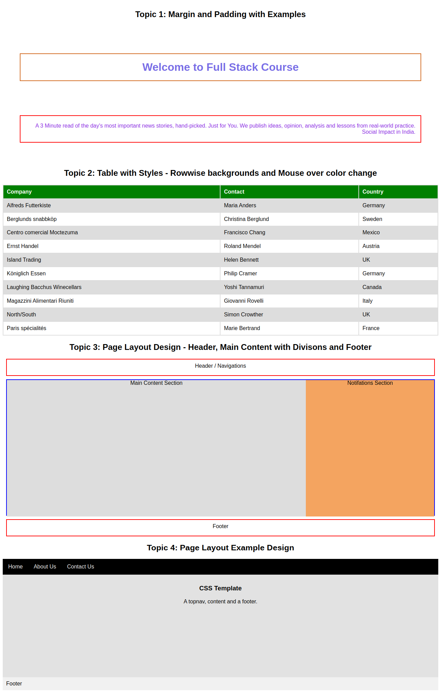
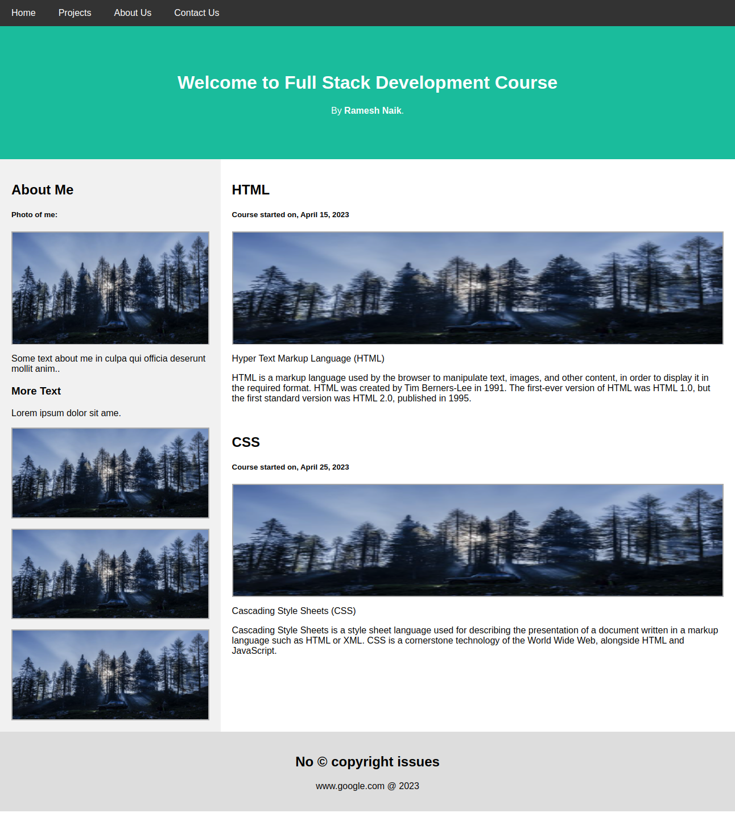

# Class 8 - CSS Page Layout

In this `class8.html` you can learn

- External CSS
- Priority of CSS
- Colors Codings
- Margins
- Padding
- HTML Tables with CSS
- HTML Page Layout Design
- Examples

## Output Screenshot

## Practice Task

Implement the following page layout

You can use `forest.jpg` image from this folder in the task.

